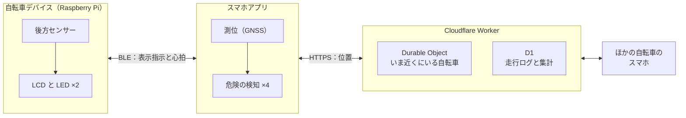

# 自転車の危険をリアルタイムに知らせるデバイス

Web×IoT メイカーズチャレンジ チームC

はじめての人向け。まず全体像、次に「自分がどこを触るのか」

---

# TODO: 何を作っているのかを1枚の絵で

自転車に乗っている人が、危険に気づく前に警告を受け取る——その1シーンだけを描く。
用語も構成も出さない。ここで伝わらなければ、この先は全部読まれない。

---

# TODO: なぜ岡山 × 自転車なのか

課題の背景。数字は1つだけ置く（多いほど記憶に残らない）。

---
layout: default
---

# 全体像

判断はスマホ、警告を出すのはデバイス。<strong>BLE に位置は流さない。</strong> この3つの箱が、そのまま <code>apps/</code> の3つのフォルダ

---

# TODO: 5つの検知が、どこで動くか

上の絵の3つの箱を色分けして、どの検知がどの箱で動くかを重ねる。
表は README にあるので、ここでは**場所**だけを見せる。

---

# TODO: なぜ「判断はスマホ、警告はデバイス」なのか

2つの絵を並べて対比する。デバイスに GPS を載せた場合と、載せない場合。

---

# TODO: 通信が死んだとき

スマホが落ちると車車間の検知は止まる。止まったことに気づくための心拍を、絵で。

---

# TODO: 走ったログが地図になる

走行ログ → 集計 → 地図とランキング。副産物ではなく、これ自体が成果物であること。

---

# TODO: リポジトリの歩き方

**全体像の絵をもう一度出し、箱の上に `apps/device` / `apps/mobile` / `apps/web` を重ねる。**
初心者が最初に迷うのは技術ではなく「自分はどこを触るのか」。

---

# TODO: 開発の進め方

Issue → ブランチ → PR → レビュー → マージ。文字ではなく1本の流れの絵にする。

---

# TODO: はじめの一歩

`mise install` と `pnpm install` の2行、そのあとに読むファイル（`docs/setup.md`）への案内。
手順そのものは書かない（`docs/setup.md` が正本）。

---

# TODO: 用語集

BLE / GNSS / Worker / D1 / Durable Object。それぞれ1行と、小さな絵を1つ。
