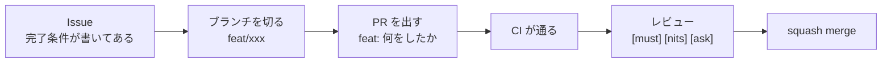

# 自転車の危険をリアルタイムに知らせるデバイス

Web×IoT メイカーズチャレンジ チームC

<div class="opacity-60 mt-8 text-sm">
はじめての人向け。まず全体像、次に「自分がどこを触るのか」
</div>

---

# 気づけない危険に、気づかせる

<div class="mt-10 flex items-stretch justify-center gap-3">
  <div class="w-56 rounded-xl border border-gray-400/30 p-5 text-center">
    <div class="i-tabler-eye-off mx-auto text-4xl opacity-60" />
    <div class="mt-3 font-bold">見えない・聞こえない</div>
    <div class="mt-1 text-xs opacity-60">後ろから来る車、曲がり角の向こうの自転車</div>
  </div>
  <div class="flex items-center opacity-30"><div class="i-tabler-chevron-right text-2xl" /></div>
  <div class="w-56 rounded-xl border border-gray-400/30 p-5 text-center">
    <div class="i-tabler-radar mx-auto text-4xl" style="color: var(--slidev-theme-primary)" />
    <div class="mt-3 font-bold">機械が先に気づく</div>
    <div class="mt-1 text-xs opacity-60">センサーと、まわりの自転車の位置</div>
  </div>
  <div class="flex items-center opacity-30"><div class="i-tabler-chevron-right text-2xl" /></div>
  <div class="w-56 rounded-xl border border-gray-400/30 p-5 text-center">
    <div class="i-tabler-alert-triangle mx-auto text-4xl" style="color: var(--slidev-theme-primary)" />
    <div class="mt-3 font-bold">その場で知らせる</div>
    <div class="mt-1 text-xs opacity-60">LED とディスプレイ。スマホは見ない</div>
  </div>
</div>

<div class="mt-10 text-center opacity-60 text-sm">
走行中にスマホを見る行為は取り締まりの対象。<strong>だから知らせる先はデバイス側</strong>
</div>

---

# TODO: なぜ岡山 × 自転車なのか

課題の背景。**数字は1つだけ置く**（多いほど記憶に残らない）。出典も添える。

<div class="mt-8 rounded-lg border border-dashed border-gray-400/50 p-6 text-center opacity-50">
ここに大きな数字を1つ
</div>

---

# 全体像

<ArchitectureDiagram />

<div class="mt-8 text-sm opacity-70">
判断はスマホ、警告を出すのはデバイス。<strong>BLE に位置は流さない。</strong><br/>
この3つの箱が、そのまま <code>apps/</code> の3つのフォルダ
</div>

---

# 5つの検知

<div class="mt-8 grid grid-cols-5 gap-2 text-center">
  <div v-for="d in [
    { icon: 'i-tabler-arrow-narrow-right', name: '急接近', id: 'approach', where: 'スマホ' },
    { icon: 'i-tabler-player-stop', name: '前方の急ブレーキ', id: 'brake', where: 'スマホ' },
    { icon: 'i-tabler-route', name: '曲がり角の対向車', id: 'corner', where: 'スマホ' },
    { icon: 'i-tabler-map-pin', name: '一時停止が近い', id: 'stop', where: 'スマホ' },
    { icon: 'i-tabler-radar', name: '後方の物体', id: 'rear_object', where: 'デバイス' },
  ]" :key="d.id" class="rounded-xl border border-gray-400/30 p-3">
    <div :class="d.icon" class="mx-auto text-3xl" :style="d.where === 'スマホ' ? 'color: var(--slidev-theme-primary)' : ''" />
    <div class="mt-2 text-sm font-bold leading-tight">{{ d.name }}</div>
    <div class="mt-1 font-mono text-[0.6rem] opacity-40">{{ d.id }}</div>
    <div class="mt-2 text-xs" :class="d.where === 'スマホ' ? 'opacity-70' : 'font-bold'">{{ d.where }}</div>
  </div>
</div>

<div class="mt-10 text-sm opacity-70">
左の4つは<strong>まわりの自転車の位置が要る</strong>ので、通信が切れると止まる。<br/>
右の1つは<strong>デバイスの中だけで完結する</strong>ので、通信が切れても動く。<strong>これが土台。</strong>
</div>

---

# なぜ「判断はスマホ、警告はデバイス」なのか

<div class="mt-8 grid grid-cols-2 gap-6">
  <div class="rounded-xl border border-gray-400/30 p-5">
    <div class="flex items-center gap-2 font-bold">
      <div class="i-tabler-device-mobile text-xl" style="color: var(--slidev-theme-primary)" />
      スマホがやること
    </div>
    <ul class="mt-3 text-sm leading-relaxed opacity-80">
      <li>自分がどこにいるかを測る（GNSS）</li>
      <li>まわりの自転車の位置を受け取る</li>
      <li>危ないかどうかを決める</li>
    </ul>
  </div>
  <div class="rounded-xl border border-gray-400/30 p-5">
    <div class="flex items-center gap-2 font-bold">
      <div class="i-tabler-bike text-xl" style="color: var(--slidev-theme-primary)" />
      デバイスがやること
    </div>
    <ul class="mt-3 text-sm leading-relaxed opacity-80">
      <li>後ろをセンサーで見る</li>
      <li>言われたとおりに LED と画面を光らせる</li>
      <li>心拍が止まったら、それを自分で表示する</li>
    </ul>
  </div>
</div>

<div class="mt-8 text-sm opacity-70">
デバイスに GPS を載せない。<strong>スマホがすでに持っているものを二重に積まない。</strong><br/>
BLE に位置を流さない。<strong>接続間隔ごとに1通という天井があり、超えた瞬間に測位ごと止まる。</strong>
</div>

---

# 通信が死んだとき

<HeartbeatTimeline />

<div class="mt-6 text-sm opacity-70">
スマホは<strong>毎秒の心拍</strong>を送る。途切れたらデバイスがそれを出し続ける。<br/>
<strong>止まったことに誰も気づけないのが一番まずい。</strong>「動いているつもり」になるため。
</div>

---

# 走ったログが地図になる

<div class="mt-10 flex items-center justify-center gap-2 text-center text-sm">
  <div v-for="(s, i) in [
    { icon: 'i-tabler-bike', title: '走る', note: '測位の点をそのまま残す' },
    { icon: 'i-tabler-database', title: '溜める', note: 'Worker の D1 へ' },
    { icon: 'i-tabler-chart-bar', title: '数える', note: '件数ではなく率で' },
    { icon: 'i-tabler-map-pin', title: '地図にする', note: 'どこが危ないか' },
  ]" :key="s.title" class="contents">
    <div v-if="i > 0" class="i-tabler-chevron-right text-xl opacity-30" />
    <div class="w-40 rounded-xl border border-gray-400/30 p-4">
      <div :class="s.icon" class="mx-auto text-3xl" style="color: var(--slidev-theme-primary)" />
      <div class="mt-2 font-bold">{{ s.title }}</div>
      <div class="mt-1 text-xs opacity-60">{{ s.note }}</div>
    </div>
  </div>
</div>

<div class="mt-10 text-sm opacity-70">
<strong>件数で並べると「危ない場所」ではなく「よく通る場所」の一覧になる。</strong><br/>
測位の点を間引かずに残しているのは、しきい値を変えるたびに走り直しにならないため。
</div>

---

# リポジトリの歩き方

<ArchitectureDiagram folders />

<div class="mt-8 text-sm opacity-70">
<strong>さっきの絵の3つの箱が、そのままフォルダになっている。</strong>
自分の担当の箱を見つければ、触る場所はそこ。<br/>
残りの <code>docs/</code> は決めたことの置き場で、<strong>迷ったら <code>README.md</code> の表がどこに何があるかを教えてくれる。</strong>
</div>

---

# 開発の進め方



<div class="mt-8 text-sm opacity-70">
<strong><code>main</code> に直接コミットしない。</strong>仕組みで止めていないので、運用で守る。<br/>
レビューの <code>[must]</code> だけが直す必須のもの。<strong><code>[nits]</code> は直さなくてよい</strong>——分けないと全部必須に見えて手が止まる。
</div>

---

# はじめの一歩

<div class="mt-8 grid grid-cols-2 gap-6">
  <div>
    <div class="font-bold">1. 環境を作る</div>
    <div class="mt-2 text-sm opacity-70">Node も Python も個別に入れなくてよい。mise がまとめて用意する</div>

```sh
mise install
pnpm install
```

  </div>
  <div>
    <div class="font-bold">2. 次に読むもの</div>
    <ul class="mt-2 text-sm leading-relaxed opacity-80">
      <li><code>docs/setup.md</code> — つまずいたときの対処まで</li>
      <li><code>CONTRIBUTING.md</code> — Issue から PR まで</li>
      <li><code>README.md</code> — どこに何が書いてあるか</li>
    </ul>
  </div>
</div>

<div class="mt-10 text-sm opacity-70">
<strong>実機が無くても開発できる。</strong>検知もシミュレータも PC 上のテストで動くように作ってある。<br/>
実機の準備を待たずに進めるのは、好みではなく<strong>満たさないと開発が止まる要件</strong>。
</div>

---

# 用語

<div class="mt-6 grid grid-cols-3 gap-3 text-sm">
  <div v-for="t in [
    { w: 'BLE', d: 'Bluetooth の省電力版。デバイスとスマホをつなぎっぱなしにする' },
    { w: 'GNSS', d: 'GPS などの測位のしくみ全体の呼び名。スマホが自分の位置を知る' },
    { w: '車車間通信', d: '自転車どうしが位置を共有すること。ここでは Worker を経由する' },
    { w: 'Worker', d: 'Cloudflare 上で動くサーバー。画面と API を1つで担っている' },
    { w: 'D1', d: 'Worker から使えるデータベース。走行ログと集計が入る' },
    { w: 'Durable Object', d: 'いま近くにいる自転車を覚えておく入れ物。メモリだけで、消えてよい' },
  ]" :key="t.w" class="rounded-lg border border-gray-400/30 p-3">
    <div class="font-bold" style="color: var(--slidev-theme-primary)">{{ t.w }}</div>
    <div class="mt-1 text-xs leading-relaxed opacity-70">{{ t.d }}</div>
  </div>
</div>

<div class="mt-10 text-sm opacity-70">
<strong>分からない言葉が出たら止まらずに聞く。</strong>
止まったことは表に出てこないので、聞かれないほうが困る
</div>
