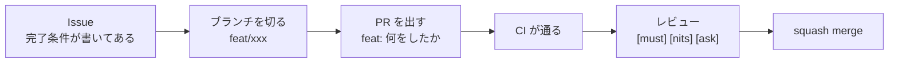

# 自転車の危険をリアルタイムに知らせるデバイス

Web×IoT メイカーズチャレンジ チームC

<div class="opacity-60 mt-8 text-sm">
<strong>前半</strong>は全員向け——何をつくっていて、どこで何が起きるか。<br/>
<strong>後半</strong>は手を動かす人向け——技術スタックと進め方。
</div>

---

# 気づけない危険に、気づかせる

<div class="mt-10 flex items-stretch justify-center gap-3">
  <div class="w-56 rounded-xl border border-gray-400/30 p-5 text-center">
    <div class="i-tabler-eye-off mx-auto text-4xl opacity-60" />
    <div class="mt-3 font-bold">見えない・聞こえない</div>
    <div class="mt-1 text-xs opacity-60">後ろから来る車、曲がり角の向こうの自転車</div>
  </div>
  <div class="flex items-center opacity-30"><div class="i-tabler-chevron-right text-2xl" /></div>
  <div class="w-56 rounded-xl border border-gray-400/30 p-5 text-center">
    <div class="i-tabler-radar mx-auto text-4xl" style="color: var(--slidev-theme-primary)" />
    <div class="mt-3 font-bold">機械が先に気づく</div>
    <div class="mt-1 text-xs opacity-60">センサーと、まわりの自転車の位置</div>
  </div>
  <div class="flex items-center opacity-30"><div class="i-tabler-chevron-right text-2xl" /></div>
  <div class="w-56 rounded-xl border border-gray-400/30 p-5 text-center">
    <div class="i-tabler-alert-triangle mx-auto text-4xl" style="color: var(--slidev-theme-primary)" />
    <div class="mt-3 font-bold">その場で知らせる</div>
    <div class="mt-1 text-xs opacity-60">LED とディスプレイ。スマホは見ない</div>
  </div>
</div>

<div class="mt-10 text-center opacity-60 text-sm">
走行中にスマホを見る行為は取り締まりの対象。<strong>だから知らせる先はデバイス側</strong>
</div>

---

# 何をつくっているのか

<div class="mt-12"><ArchitectureDiagram abstract /></div>

<div class="mt-12 flex items-center justify-center gap-8 text-xs">
  <div class="opacity-40">色の約束</div>
  <div v-for="c in [
    { layer: 'device', name: '装置の話' },
    { layer: 'mobile', name: 'スマホの話' },
    { layer: 'cloud', name: '向こう側の話' },
  ]" :key="c.name" class="flex items-center gap-2">
    <div class="h-2.5 w-2.5 rounded-full" :style="`background: var(--layer-${c.layer})`" />
    <div>{{ c.name }}</div>
  </div>
  <div class="opacity-40">——このあとのスライドでも同じ意味で使う</div>
</div>

<div class="mt-10 text-sm opacity-70">
<strong>3つで1セット。</strong>ただし<strong>装置だけは、通信が死んでも後ろを見続ける</strong>——
まるごと黙らせないための土台として、そこだけ独立させてある。
</div>

---

# 1回の走行で、何が起きるか

<div class="mt-6 space-y-1.5">
  <div v-for="(s, i) in [
    { when: '乗る前', layer: 'mobile', icon: 'i-tabler-device-mobile-pin', what: 'スマホをハンドルに固定して、アプリを開く', note: '画面は消したままでよい。ポケットや鞄だと位置がずれる' },
    { when: 'つながる', layer: 'device', icon: 'i-tabler-bluetooth', what: '装置とスマホが、短い距離の無線でつながりっぱなしになる', note: '以降つなぎ直さない' },
    { when: '走る', layer: 'mobile', icon: 'i-tabler-bike', what: '1秒ごとに自分の位置を測り、向こう側に渡す', note: '同じあたりを走っている自転車の位置が返ってくる' },
    { when: '危ない', layer: 'device', icon: 'i-tabler-alert-triangle', what: 'スマホが判断し、装置が光る', note: 'ここでスマホは見ない。見るのは取り締まりの対象' },
    { when: '降りたあと', layer: 'cloud', icon: 'i-tabler-cloud-upload', what: '走った記録が向こう側へ送られる', note: '走行中の通信に、保存の重さを載せない' },
    { when: 'あとで', layer: 'cloud', icon: 'i-tabler-map-2', what: 'Web の地図とランキングで「どこが危なかったか」を見る', note: '自分のぶんだけでなく、みんなのぶんが集まる' },
  ]" :key="s.when" class="flex items-center gap-3 rounded-lg border border-gray-400/20 px-3 py-2">
    <div class="w-20 shrink-0 text-right text-xs font-bold opacity-70">{{ s.when }}</div>
    <div :class="s.icon" class="shrink-0 text-xl" :style="`color: var(--layer-${s.layer})`" />
    <div class="min-w-0 flex-1">
      <div class="text-sm leading-tight">{{ s.what }}</div>
      <div class="text-[0.65rem] leading-tight opacity-50">{{ s.note }}</div>
    </div>
  </div>
</div>

<div class="mt-6 text-sm opacity-70">
<strong>乗っている人の操作は、最初にアプリを開くだけ。</strong>
走っている間に何かを押させる設計にしない——<strong>手が離れる時点で危ない。</strong>
</div>

---

# 5つの検知

<div class="mt-6 grid grid-cols-3 gap-4">
  <div v-for="g in [
    {
      layer: 'mobile', head: 'まわりが見えるから分かる', need: '通信が要る',
      items: ['急接近', '前方の急ブレーキ', '曲がり角の対向車'],
      note: 'ほかの自転車の位置が届いて、はじめて成り立つ',
    },
    {
      layer: 'mobile', head: '自分の位置だけで分かる', need: '通信は要らない',
      items: ['一時停止が近い'],
      note: '標識のデータはスマホの中に持っている。圏外でも鳴る',
    },
    {
      layer: 'device', head: '装置だけで分かる', need: 'スマホも要らない',
      items: ['後方の物体'],
      note: 'センサーで直接見る。ここが土台',
    },
  ]" :key="g.head" class="overflow-hidden rounded-xl border border-gray-400/30"
       :style="`border-top: 3px solid var(--layer-${g.layer})`">
    <div class="p-4">
      <div class="text-sm font-bold leading-tight">{{ g.head }}</div>
      <div class="mt-1 text-[0.65rem] font-bold" :style="`color: var(--layer-${g.layer})`">{{ g.need }}</div>
      <div class="mt-3 space-y-1.5">
        <div v-for="d in g.items" :key="d" class="rounded-lg bg-gray-100 px-2 py-2 text-center text-xs">{{ d }}</div>
      </div>
      <div class="mt-3 text-[0.65rem] leading-relaxed opacity-55">{{ g.note }}</div>
    </div>
  </div>
</div>

<div class="mt-8 text-sm opacity-70">
<strong>右へ行くほど、頼っているものが減る。</strong>
通信が切れても一時停止は鳴り、スマホごと落ちても後方は見え続ける。<br/>
<strong>通信が前提のものだけで組むと、圏外に入った瞬間にただの飾りになる。</strong>

</div>

<!--
ここは「5つある」ことより「支えが3段になっている」ことを話す。
一時停止を「まわりが見えるから分かる」側に混ぜない——あれは周辺車両を見ていない。
-->

---

# 危険を知らせるまでの、1秒

<div class="mt-8 flex items-stretch justify-center gap-1 text-center">
  <div v-for="(s, i) in [
    { layer: 'mobile', icon: 'i-tabler-current-location', title: '測る', what: '自分がいまどこにいるか' },
    { layer: 'cloud', icon: 'i-tabler-arrows-exchange', title: '配る', what: '同じあたりの自転車と交換する' },
    { layer: 'mobile', icon: 'i-tabler-brain', title: '決める', what: 'スマホの4つの検知にかけて判定' },
    { layer: 'mobile', icon: 'i-tabler-bluetooth', title: '伝える', what: '「どう光るか」だけを装置へ送る' },
    { layer: 'device', icon: 'i-tabler-bulb', title: '出す', what: 'LED とディスプレイに出る' },
  ]" :key="s.title" class="contents">
    <div v-if="i > 0" class="flex items-center opacity-25"><div class="i-tabler-chevron-right text-xl" /></div>
    <div class="w-36 overflow-hidden rounded-xl border border-gray-400/30"
         :style="`border-top: 3px solid var(--layer-${s.layer})`">
      <div class="p-3">
        <div :class="s.icon" class="mx-auto text-2xl" :style="`color: var(--layer-${s.layer})`" />
        <div class="mt-2 text-sm font-bold">{{ s.title }}</div>
        <div class="mt-1 text-[0.65rem] leading-tight opacity-60">{{ s.what }}</div>
      </div>
    </div>
  </div>
</div>

<div class="mt-10 text-sm opacity-70">
<strong>装置に届くのは「どう光るか」だけで、位置は流れてこない。</strong>
だから装置は、まわりに誰がいるかを知らない。<br/>
この1秒が毎秒くり返される。<strong>後方の物体だけはこの流れに乗らず、装置の中だけで完結する。</strong>
</div>

---

# 走行中、何が光って何が出るのか

<div class="mt-6 grid grid-cols-[auto_1fr] items-start gap-8">
  <div class="text-center">
    <!-- LED の色はまだ決まっていない（docs/hardware.md）。決めていない色をここに描かない -->
    <div class="flex items-center justify-center gap-6">
      <div v-for="l in [
        { name: '警告の LED', state: 'どれくらい危ないか' },
        { name: 'link の LED', state: '仕組みが生きているか' },
      ]" :key="l.name">
        <div class="mx-auto h-5 w-5 rounded-full border-2 border-gray-400/60 bg-gray-300/40" />
        <div class="mt-1.5 text-[0.65rem] font-bold">{{ l.name }}</div>
        <div class="text-[0.6rem] opacity-50">{{ l.state }}</div>
      </div>
    </div>
    <div class="mt-1.5 text-[0.6rem] opacity-50">色はまだ決めていない。<br/>決まっているのは<strong>「2つを違う色にする」</strong>ことだけ</div>
    <div class="mt-4"><LcdScreen line1="!!! REAR" line2="OK    >" /></div>
    <div class="mt-2 text-[0.6rem] opacity-50">「後ろから何か来ている・かなり危ない」<br/>「仕組みは生きている・走行中」</div>
  </div>

  <div class="space-y-2">
    <div v-for="o in [
      { name: '警告の LED', what: 'どれくらい危ないか、3段階だけ', how: 'ゆっくり点滅 → 速い点滅 → 点灯' },
      { name: 'link の LED', what: '仕組みが生きているか', how: '正常なら点灯。おかしくなると点滅に変わる' },
      { name: '画面の上段', what: 'いま何が起きているか。1件だけ', how: '危険の強さと、5種類の記号' },
      { name: '画面の下段', what: '仕組みが生きているか', how: '警告に場所を譲らない。常に同じ桁' },
    ]" :key="o.name" class="flex items-baseline gap-3 rounded-lg border border-gray-400/20 px-3 py-2">
      <div class="w-24 shrink-0 text-xs font-bold">{{ o.name }}</div>
      <div class="min-w-0 flex-1">
        <div class="text-xs">{{ o.what }}</div>
        <div class="text-[0.65rem] opacity-50">{{ o.how }}</div>
      </div>
    </div>
  </div>
</div>

<div class="mt-6 text-sm opacity-70">
<strong>光は「どれくらい危ないか」だけを伝え、「何の危険か」は伝えない。</strong>
5種類の点滅を走りながら見分けることはできず、増やすとどれも「何か光った」になる。<br/>
<strong>種類を知りたければ、止まって画面を見る。</strong><br/>
2つの LED を違う色にするのは、<strong>走行中の視界の端では「どちらが光ったか」が色でしか分からない</strong>ため。
</div>

<!--
ここは「何が出るか」より「なぜこれだけなのか」を話す。
・光で種類を分けない → lv 3 に対して人がすることは種類によらず同じ（落とす・止まる）
・LED が2個で色が違う → 同じ色だと、走行中の視界の端でどちらが光ったのか分からない
-->

---

# なぜ「判断はスマホ、知らせるのは装置」なのか

<div class="mt-8 grid grid-cols-2 gap-6">
  <div class="overflow-hidden rounded-xl border border-gray-400/30" style="border-top: 3px solid var(--layer-mobile)">
    <div class="p-5">
      <div class="flex items-center gap-2 font-bold">
        <div class="i-tabler-device-mobile text-xl" style="color: var(--layer-mobile)" />
        スマホがやること
      </div>
      <ul class="mt-3 text-sm leading-relaxed opacity-80">
        <li>自分がどこにいるかを測る</li>
        <li>まわりの自転車の位置を受け取る</li>
        <li>危ないかどうかを決める</li>
      </ul>
    </div>
  </div>
  <div class="overflow-hidden rounded-xl border border-gray-400/30" style="border-top: 3px solid var(--layer-device)">
    <div class="p-5">
      <div class="flex items-center gap-2 font-bold">
        <div class="i-tabler-bike text-xl" style="color: var(--layer-device)" />
        装置がやること
      </div>
      <ul class="mt-3 text-sm leading-relaxed opacity-80">
        <li>後ろをセンサーで見る</li>
        <li>言われたとおりに LED と画面を光らせる</li>
        <li>合図が止まったら、それを自分で表示する</li>
      </ul>
    </div>
  </div>
</div>

<div class="mt-8 text-sm opacity-70">
装置に位置を測る部品を載せない。<strong>スマホがすでに持っているものを二重に積まない。</strong><br/>
無線に位置を流さない。<strong>この無線で送れるのは、つながり1回につき1通だけ。</strong>
まわりの自転車を毎秒ぜんぶ流すとその1通を使い切り、<strong>肝心の「どう光るか」が送れなくなる。</strong>
</div>

<!--
「二重に積まない」は値段の話ではなく、部品が増えるほど壊れる箇所と配線が増えるという話。
天井の数字（接続間隔・通数）は docs/adr/0006 にある。ここでは「1通」とだけ言えば足りる。
-->

---

# 通信が死んだとき

<HeartbeatTimeline />

<div class="mt-6 text-sm opacity-70">
スマホは<strong>心拍</strong>——「まだ生きている」という合図——を毎秒送る。
途切れたら、装置がそれを出し続ける。<br/>
<strong>止まったことに誰も気づけないのが一番まずい。</strong>
警告が出ないのは「安全だから」か「壊れているから」か、乗っている人には見分けがつかない。
</div>

<!--
ここは削ってはいけない例外の1つ（CLAUDE.md「静かに黙る故障」）。
「動いているつもり」で走り続けるほうが、最初から何も付けていないより危ない、と言い切ってよい。
-->

---

# 走ったログが地図になる

<div class="mt-10 flex items-center justify-center gap-2 text-center text-sm">
  <div v-for="(s, i) in [
    { icon: 'i-tabler-bike', title: '走る', note: '測位の点をそのまま残す' },
    { icon: 'i-tabler-database', title: '溜める', note: '向こう側に貯める' },
    { icon: 'i-tabler-chart-bar', title: '数える', note: '件数ではなく率で' },
    { icon: 'i-tabler-map-pin', title: '地図にする', note: 'どこが危ないか' },
  ]" :key="s.title" class="contents">
    <div v-if="i > 0" class="i-tabler-chevron-right text-xl opacity-30" />
    <div class="w-40 rounded-xl border border-gray-400/30 p-4">
      <div :class="s.icon" class="mx-auto text-3xl" style="color: var(--layer-cloud)" />
      <div class="mt-2 font-bold">{{ s.title }}</div>
      <div class="mt-1 text-xs opacity-60">{{ s.note }}</div>
    </div>
  </div>
</div>

<div class="mt-10 text-sm opacity-70">
<strong>件数で並べると「危ない場所」ではなく「よく通る場所」の一覧になる。</strong>
駅前は通る人が多いので、件数で数えれば必ず上位に来てしまう。<br/>
だから<strong>「そこを通った走行のうち、何回で危険が出たか」</strong>で見る。
</div>

---

# Web を開くと、何が見えるか

<div class="mt-8 grid grid-cols-2 gap-6">
  <div class="overflow-hidden rounded-xl border border-gray-400/30" style="border-top: 3px solid var(--layer-cloud)">
    <div class="p-5">
      <div class="flex items-center gap-2 font-bold">
        <div class="i-tabler-map-2 text-xl" style="color: var(--layer-cloud)" />
        マップ + ランキング
      </div>
      <div class="mt-3 text-sm leading-relaxed opacity-75">
        左に地図、右に順位表。<strong>同じデータの2つの見せ方</strong>を1ページに並べる。
        順位表の行をクリックすると、地図がその場所へ飛ぶ
      </div>
      <div class="mt-3 text-xs opacity-60">
        地図だけだと順位が読めない。順位表だけだと、そこがどこか分からない
      </div>
    </div>
  </div>
  <div class="overflow-hidden rounded-xl border border-gray-400/30" style="border-top: 3px solid var(--layer-cloud)">
    <div class="p-5">
      <div class="flex items-center gap-2 font-bold">
        <div class="i-tabler-list-details text-xl" style="color: var(--layer-cloud)" />
        場所の詳細
      </div>
      <div class="mt-3 text-sm leading-relaxed opacity-75">
        1つの場所の内訳。<strong>時間帯ごとに</strong>、何の種類が何件で、何走行ぶんが通ったか
      </div>
      <div class="mt-3 text-xs opacity-60">
        秒単位の時刻も端末の区別も出さない。出すと、1人の走った道が復元できてしまう
      </div>
    </div>
  </div>
</div>

<div class="mt-8 text-sm opacity-70">
<strong>画面は2つだけ。</strong>ログインも置かない。作り込むより、1本つながっていることを優先する。<br/>
一時停止の標識は公開データから取り込み、走った記録と突き合わせて<strong>あとから計算する</strong>ので、
何度でもやり直せる。
</div>

---
layout: section
---

<div class="mb-6 flex gap-1">
  <div v-for="l in ['device', 'mobile', 'cloud']" :key="l"
       class="h-1.5 w-16 rounded-full" :style="`background: var(--layer-${l})`" />
</div>

# ここから開発者向け

<div class="mt-4 opacity-60">
手を動かす人だけ読めばよい。<strong>前半と同じ絵に、製品名と手順を足していく</strong>
</div>

---

# 同じ絵を、技術スタックで見る

<ArchitectureDiagram />

<div class="mt-8 grid grid-cols-3 gap-4 text-xs">
  <div v-for="c in [
    { layer: 'device', dir: 'apps/device', stack: 'Python 3.11 / uv / pytest' },
    { layer: 'mobile', dir: 'apps/mobile', stack: 'Expo (React Native) / TypeScript / Vitest' },
    { layer: 'cloud', dir: 'apps/web', stack: 'React / Vite / Hono / D1 / Durable Objects' },
  ]" :key="c.dir" class="overflow-hidden rounded-lg border border-gray-400/20"
       :style="`border-left: 3px solid var(--layer-${c.layer})`">
    <div class="px-3 py-2">
      <div class="font-mono font-bold">{{ c.dir }}</div>
      <div class="mt-1 leading-relaxed opacity-60">{{ c.stack }}</div>
    </div>
  </div>
</div>

<div class="mt-6 text-sm opacity-70">
<strong>画面と API は1つの Worker にまとめてある。</strong>分けると、型を共有するためだけに境界が増える。<br/>
まわりの自転車を覚えるのは <strong>Durable Object のメモリだけ</strong>で、データベースに書かない——位置情報は<strong>消えるほうが既定で安全</strong>。
</div>

---

# リポジトリの歩き方

<ArchitectureDiagram folders />

<div class="mt-6 grid grid-cols-2 gap-6 text-sm">
  <div>
    <div class="font-bold">自分の担当の箱を見つければ、触る場所はそこ</div>
    <div class="mt-2 text-xs leading-relaxed opacity-70">
      <code>apps/web</code> だけは中でさらに分かれる——<br/>
      <code>src/client/</code>（画面） <code>src/worker/</code>（API） <code>src/shared/</code>（共有する型）。
      <strong>client と worker を混ぜない</strong>。担当が違うのでコンフリクトする
    </div>
  </div>
  <div>
    <div class="font-bold"><code>docs/</code> は決めたことの置き場</div>
    <ul class="mt-2 text-xs leading-relaxed opacity-70">
      <li><code>docs/adr/</code> — <strong>なぜそう決めたか</strong>。迷ったらここ</li>
      <li><code>docs/interfaces/</code> — 箱と箱の<strong>境界の仕様</strong></li>
      <li><code>docs/unverified.md</code> — <strong>実機で確かめていない前提</strong></li>
    </ul>
  </div>
</div>

<div class="mt-6 text-sm opacity-70">
<strong>迷ったら <code>README.md</code> の表</strong>が、どこに何があるかを教えてくれる。
</div>

---

# 実機が無くても開発できる

<div class="mt-8 grid grid-cols-2 gap-6">
  <div class="rounded-xl border border-gray-400/30 p-5">
    <div class="flex items-center gap-2 font-bold">
      <div class="i-tabler-test-pipe text-xl" style="color: var(--slidev-theme-primary)" />
      検知は「入れたら返る関数」
    </div>
    <div class="mt-3 text-sm leading-relaxed opacity-75">
      センサーにも無線にも触らない。<strong>位置のモックデータを渡すだけでテストが回る</strong>
    </div>
    <div class="mt-3 text-xs opacity-60">
      <code>Date.now()</code> も呼ばない。「いま」は引数で受け取る——
      <strong>同じ入力で結果が変わると、テストが書けない</strong>
    </div>
  </div>
  <div class="rounded-xl border border-gray-400/30 p-5">
    <div class="flex items-center gap-2 font-bold">
      <div class="i-tabler-topology-star-3 text-xl" style="color: var(--slidev-theme-primary)" />
      複数台はシミュレータで模す
    </div>
    <div class="mt-3 text-sm leading-relaxed opacity-75">
      PC 上で自転車を何台か走らせて、<strong>検知が発火するかを確かめられる</strong>
      （<code>apps/mobile/src/sim/</code>）
    </div>
    <div class="mt-3 text-xs opacity-60">
      実機が揃ってから作るのでは間に合わない。<strong>だから最初に用意してある</strong>
    </div>
  </div>
</div>

<div class="mt-8 text-sm opacity-70">
<strong>実機での確認を待たずに進める。</strong>理論上成立することを根拠に書き、形になってから検証する。<br/>
好みではなく、<strong>満たさないと開発が止まる要件</strong>。確かめていない前提は <code>docs/unverified.md</code> に積む。
</div>

---

# 検知を1つ足す

<div class="mt-6 grid grid-cols-2 gap-6">
  <div>

```ts
// 1. apps/mobile/src/detect/<名前>.ts を作る
export type MyConfig = { warnDistanceM: number };
export const myDefaults: MyConfig = {
  warnDistanceM: 20,
};

export const detectMy: Detector<MyConfig> =
  (input, config) => {
    // input: 自車 / 周辺車両 / 標識 / いま
    return null;  // 警告が無ければ null
  };

// 2. apps/mobile/src/ride/detectors.ts に1行足す
register("my", detectMy, myDefaults),
```

  </div>
  <div class="text-sm">
    <div class="font-bold">4つとも同じ形をしている</div>
    <div class="mt-2 text-xs leading-relaxed opacity-70">
      入力は<strong>4つ全部が同じ型</strong>。使わない項目があってよい——
      急接近は標識を見ないし、一時停止は周辺車両を見ない。
      <strong>揃えてあるので、呼ぶ側は4つを同じ形で回せる</strong>
    </div>
    <div class="mt-5 font-bold">足すのは1行だけ</div>
    <div class="mt-2 text-xs leading-relaxed opacity-70">
      呼び出し側（走行ループ）は書き換えない。
      <strong>全員が同じ行を編集すると必ずコンフリクトする</strong>ので、
      登録の配列に1行足す形にしてある
    </div>
    <div class="mt-5 font-bold">しきい値はコードに直書きしない</div>
    <div class="mt-2 text-xs leading-relaxed opacity-70">
      設定として外に出し、<strong>その検知のファイルに既定値を置く</strong>。
      1か所にまとめると、そこで全員がぶつかる
    </div>
  </div>
</div>

<div class="mt-4 flex flex-wrap items-baseline gap-x-5 gap-y-1 text-xs">
  <div class="opacity-40">コードの中での名前</div>
  <div v-for="k in [
    ['approach', '急接近'], ['brake', '前方の急ブレーキ'], ['corner', '曲がり角の対向車'],
    ['stop', '一時停止が近い'], ['rear_object', '後方の物体'],
  ]" :key="k[0]" class="flex items-baseline gap-1.5">
    <code>{{ k[0] }}</code><span class="opacity-50">{{ k[1] }}</span>
  </div>
</div>

<div class="mt-4 text-sm opacity-70">
仕様の正本は <code>docs/interfaces/detectors.md</code>。<strong>実装先は <code>apps/mobile</code></strong> であって装置側ではない。
</div>

---

# 画面と光の決まりごと

<div class="mt-5 grid grid-cols-[auto_1fr] items-start gap-8">
  <div>
    <LcdScreen line1="!!! REAR" line2="OK    >" ruler />
    <div class="mt-3 space-y-1 text-[0.65rem] leading-relaxed opacity-70">
      <div><strong>上段</strong> 0〜2 危険の強さ（<code>!</code> の本数）／ 4〜7 種類の記号</div>
      <div><strong>下段</strong> 0〜4 <code>link</code> ／ 6 走行中か（<code>&gt;</code> / <code>-</code>）</div>
      <div><strong>停止中だけ</strong>、上段の全桁と下段の 8〜15 を情報に開放する</div>
    </div>
  </div>

  <div class="space-y-4">
    <div>
      <div class="text-sm font-bold">種類は4文字の記号に揃える</div>
      <div class="mt-2 flex flex-wrap gap-x-4 gap-y-1 text-xs">
        <div v-for="k in [
          ['REAR', '後方の物体'], ['APPR', '急接近'], ['BRK', '前方の急ブレーキ'],
          ['CRNR', '曲がり角の対向車'], ['STOP', '一時停止が近い'],
        ]" :key="k[0]" class="flex items-baseline gap-1.5">
          <code>{{ k[0] }}</code><span class="opacity-50">{{ k[1] }}</span>
        </div>
      </div>
      <div class="mt-1.5 text-[0.65rem] leading-relaxed opacity-55">
        <strong>この画面に漢字は出せない。</strong>内蔵フォントに無く、
        「止まれ」と出す方法を探すと時間が溶ける
      </div>
    </div>
    <div>
      <div class="text-sm font-bold">光は状態であって、イベントではない</div>
      <div class="mt-1.5 text-[0.65rem] leading-relaxed opacity-70">
        <strong>選ばれている警告の強さを、毎周期そのまま出す。</strong>
        一度光らせて終わりにすると、危険が続いている最中に消える
      </div>
    </div>
    <div>
      <div class="text-sm font-bold">正常なときも消さない</div>
      <div class="mt-1.5 text-[0.65rem] leading-relaxed opacity-70">
        <strong>消灯は「壊れて光っていない」と区別がつかない。</strong>
        だから <code>link</code> が正常でも LED は点灯させ、下段にも <code>OK</code> を出し続ける。
        警告の LED は光る機会が無いので、<strong>起動時に1秒だけ点灯</strong>して生存を見せる
      </div>
    </div>
  </div>
</div>

<div class="mt-5 text-sm opacity-70">
正本は <code>docs/notifications/arbitration.md</code>。
<strong>点滅の速さ・出し続ける秒数はすべて仮の値</strong>で、設定として外に出してある——
<strong>この資料に数字を写さない。</strong>実地で変わる。
</div>

---

# 開発の進め方



<div class="mt-6 grid grid-cols-2 gap-6 text-xs">
  <div>
    <div class="text-sm font-bold">守るもの</div>
    <ul class="mt-2 leading-relaxed opacity-70">
      <li><strong><code>main</code> に直接コミットしない。</strong>仕組みで止めていないので運用で守る</li>
      <li>ブランチは <strong><code>main</code> から</strong>切る。未マージの PR の上に積まない</li>
      <li>PR タイトルがそのまま履歴になる（squash merge）</li>
    </ul>
  </div>
  <div>
    <div class="text-sm font-bold">レビューの3つの札</div>
    <ul class="mt-2 leading-relaxed opacity-70">
      <li><code>[must]</code> — <strong>直す必須のもの。これだけ</strong></li>
      <li><code>[nits]</code> — 直さなくてよい</li>
      <li><code>[ask]</code> — 質問。答えれば済む</li>
    </ul>
    <div class="mt-2 opacity-50">分けないと、全部が必須に見えて手が止まる</div>
  </div>
</div>

---

# 用語

<div class="mt-6 grid grid-cols-3 gap-3 text-sm">
  <div v-for="t in [
    { w: 'BLE', plain: '短い距離の無線', d: 'Bluetooth の省電力版。装置とスマホをつなぎっぱなしにする' },
    { w: 'GNSS', plain: '位置を測る', d: 'GPS などの測位のしくみ全体の呼び名' },
    { w: '車車間通信', plain: 'まわりと位置を交換する', d: '自転車どうしが位置を共有すること。ここでは向こう側を経由する' },
    { w: 'Worker', plain: '向こう側', d: 'Cloudflare 上で動くサーバー。画面と API を1つで担っている' },
    { w: 'D1', plain: '走った記録の置き場', d: 'Worker から使えるデータベース。走行ログと集計が入る' },
    { w: 'Durable Object', plain: 'いま近くにいる自転車', d: '覚えておく入れ物。メモリだけで、消えてよい' },
  ]" :key="t.w" class="rounded-lg border border-gray-400/30 p-3">
    <div class="font-bold" style="color: var(--slidev-theme-primary)">{{ t.w }}</div>
    <div class="mt-0.5 text-xs opacity-50">前半での呼び方: {{ t.plain }}</div>
    <div class="mt-1.5 text-xs leading-relaxed opacity-70">{{ t.d }}</div>
  </div>
</div>

<div class="mt-8 text-sm opacity-70">
<strong>分からない言葉が出たら止まらずに聞く。</strong>
止まったことは表に出てこないので、聞かれないほうが困る
</div>

---

# はじめの一歩

<div class="mt-8 grid grid-cols-2 gap-6">
  <div>
    <div class="font-bold">1. 環境を作る</div>
    <div class="mt-2 text-sm opacity-70">Node も Python も個別に入れなくてよい。mise がまとめて用意する</div>

```sh
mise install          # Node / Python をまとめて用意
pnpm install          # 依存を入れる
pnpm --filter web dev # 画面が出れば成功
```

<div class="mt-2 text-xs opacity-60">
ルートの <code>pnpm dev</code> はスマホアプリまで一緒に起動する。<strong>最初は <code>--filter web</code> を付ける</strong>
</div>

  </div>
  <div>
    <div class="font-bold">2. 次に読むもの</div>
    <ul class="mt-2 text-sm leading-relaxed opacity-80">
      <li><code>docs/setup.md</code> — つまずいたときの対処まで</li>
      <li><code>CONTRIBUTING.md</code> — Issue から PR まで</li>
      <li><code>README.md</code> — どこに何が書いてあるか</li>
    </ul>
    <div class="mt-4 font-bold">3. 拾う Issue を探す</div>
    <div class="mt-2 text-sm leading-relaxed opacity-70">
      <code>good first issue</code> の札が付いたものは<strong>手順まで書いてある</strong>。
      完了条件が書かれているので、できたかどうかを自分で判定できる
    </div>
  </div>
</div>

<div class="mt-8 text-sm opacity-70">
<strong>Windows でも macOS でも同じ手順で動く。</strong>
そうでなくなる変更（シェル依存のコマンド、パス区切りの直書き）は入れない。
</div>
