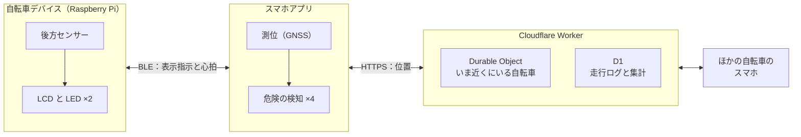

# 自転車の危険をリアルタイムに知らせるデバイス

Web×IoT メイカーズチャレンジ チームC

岡山県の課題を Web×IoT で解決する

---

# TODO: 課題

岡山 × 自転車。数字は1つだけ。

---

# TODO: 誰の、どんな瞬間か

課題を人の1シーンに落とす。ここで聴き手を当事者にできるかが、残り6分の効き方を決める。

---

# TODO: 解決策を1枚の絵で

**次のデモを抜いても、この絵から「しくみ」へそのままつながるように描く。**
デモが入るかどうかで構成を組み直さないための土台。

---
layout: center
class: text-center
---

# デモ

約2分。実機・画面切り替え・動画のいずれか。 
動画に差し替えるときは <code>public/demo/</code> に置いて、このスライドに &lt;video&gt; を書く。

<!--
このスライドは丸ごと抜いてよい。抜いても前後がつながることを、前後のスライドで担保している。
-->

---
layout: default
---

# しくみ

---

# TODO: 5つの検知

何を検知するのか。1つずつ説明せず、**通信を使う4つと、使わない1つ**という分け方だけを見せる。

---

# TODO: こだわった点

判断をスマホに寄せた理由と、通信が死んでもデバイスが黙らないこと。
技術の話が許されるのはここだけなので、2つに絞る。

---

# TODO: 走行ログが地図になる

危険を防ぐだけで終わらず、どこが危ないかが残る。件数ではなく率で見る理由まで。

---

# TODO: 今後

実機での検証と、データが溜まったあとにできること。

---
layout: center
class: text-center
---

# TODO: まとめ

一番伝えたいこと1行に戻る。
